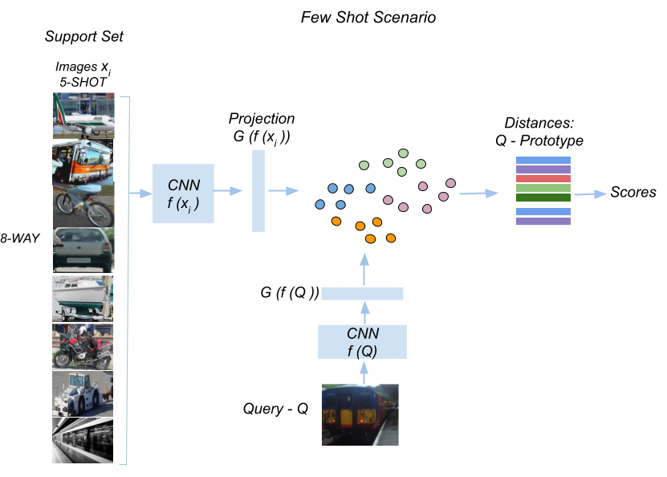

# Few Shot Learning with CLIP
Few Shot Learning using CLIP as visual feature extractor.

* To Train the models and visualize results please refer to the file FSL Case Study.ipynb (Jupyter-Notebook).

Steps to reproduce the results:

## Install
Create conda environment

    $ conda create -n clip python=3.6
    
Activate the environment:

    $ conda activate clip  

Install Open AI CLIP dependencies:

    $ conda install --yes -c pytorch pytorch=1.7.1 torchvision cudatoolkit=10.2
    $ pip install ftfy regex tqdm
    $ pip install git+https://github.com/openai/CLIP.git
    

Check if all dependencies are met comparing to the environment.yml file provided.

## Data

Create the folder ./data/coco_crops_few_shot

Create the json files required to train/eval the model:

    $ python preproc_data.py

## Weights
Weights for the pretrained models can be obtained from:

## Training

